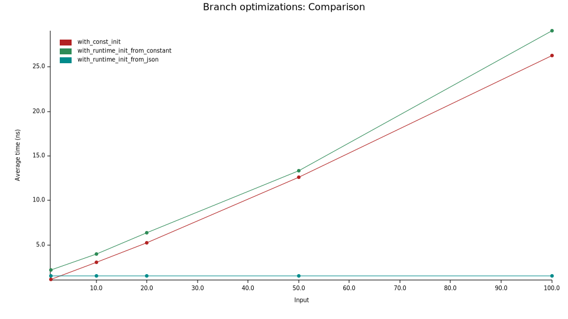

# Benchmarks

We want to measure the impact of using our crate on performance.

## Setup

- OS: Windows 10 Windows 10.0.26100 x86_64 (X64)
- RAM: 32G
- CPU: AMD Ryzen 5 5600X 6-Core Processor (3.70 GHz)
- rustc: 1.90.0 (1159e78c4 2025-09-14)
- cargo: 1.90.0 (840b83a10 2025-07-30)
- bench framework: Criterion

## Bench code

In the `benches/` directory

## Bench description

We are measuring the impact of being able to optimize the branch optimizations from the compiler.

For this our bench function just contains a branch which checks the fields of our test value.
The test value is obtained by 3 different manners:
- parsed from a JSON file (`with_json_parsing`)
- initialized at build time using our crate (`with_const_init`)
- is a reference to the constant obtained with our crate but the compiler can't guess it and optimize the branches (`with_runtime_init`)

The branch check is actually always true but if the test value is constant the
compiler optimizes these checks away and should be faster.
Finally we test with different inputs which just increases how much work is done
after passing the branch check.

### Measuring with initialization time


We can easily see that this bench is skewed by the initialization time of our struct.
Parsing from a JSON file is slow and any compiler optimizations gain/loss are negligible
compared to the parsing phase.

### Measuring without initialization time

This time we remove the initialization phase from our benchmarks



What we can observe:
1. `with_const_init` is slightly faster than `with_runtime_init` and `with_json_parsing` but not by much
2. `with_runtime_init` and `with_json_parsing` have similar performance

This is what we were expecting a slight increase due to compiler optimizations.
Let's calculate the performance increase:


#### Inspecting the assembly

```asm
work_init_from_json:
  ; Stack setup
	push rsi
	sub rsp, 112
	mov esi, ecx
	; Store foo_bar from json in [rsp+48]
	lea rcx, [rsp + 48]
	call const_init_bench::utils::FooBar::from_json_file
	xor eax, eax
	; check value of foo_bar.foo
	cmp byte ptr [rsp + 104], 1
	jne .LBB247_9
	; check value of foo_bar.bar
	cmp qword ptr [rsp + 64], -34
	jne .LBB247_9
	; store foo_bar.b: [isize;3] into 2 xmm 128bits-register
	movdqu xmm0, xmmword ptr [rsp + 72]
	movq xmm1, qword ptr [rsp + 88]
	; cmp foo_bar.b with [0,1,2]
	pcmpeqb xmm1, xmmword ptr [rip + __xmm@00000000000000000000000000000002]
	pcmpeqb xmm0, xmmword ptr [rip + __xmm@00000000000000010000000000000000]
	; make sure all bits comparison are equal
	pand xmm0, xmm1
	pmovmskb ecx, xmm0
	xor eax, eax
	cmp ecx, 65535
	jne .LBB247_9
	; move foo_bar.c: f64 into xmm register
	movsd xmm0, qword ptr [rsp + 96]
	; compare xmm register with 3.14 approximation
	ucomisd xmm0, qword ptr [rip + __real@40091eb851eb851f]
	jne .LBB247_9
	jp .LBB247_9
	; check size of the string to compare has size 5
	cmp qword ptr [rsp + 56], 5
	jne .LBB247_9
	; string comparison of foo_bar.d: &str = "ding!"
	mov rax, qword ptr [rsp + 48]
	mov ecx, 1735289188
	xor ecx, dword ptr [rax]
	movzx eax, byte ptr [rax + 4]
	xor eax, 33
	or eax, ecx
	setne al
	test esi, esi
	sete cl
	or cl, al
	jne .LBB247_6
	xor eax, eax
	lea rcx, [rsp + 40]
.LBB247_8:
  ; loop doing black_box operation
	add rax, -34
	mov qword ptr [rsp + 40], rax
	#APP
	#NO_APP
	mov rax, qword ptr [rsp + 40]
	dec esi
	jne .LBB247_8
.LBB247_9:
	add rsp, 112
	pop rsi
	ret
.LBB247_6:
	xor eax, eax
	add rsp, 112
	pop rsi
	ret

work_constant:
		push rax
		xor eax, eax
		test ecx, ecx
		je .LBB246_3
		mov rdx, rsp
.LBB246_2:
		add rax, -34
		mov qword ptr [rsp], rax
		#APP
		#NO_APP
		mov rax, qword ptr [rsp]
		dec ecx
		jne .LBB246_2
.LBB246_3:
		pop rcx
		ret
```

The assembly code is as we expected
- `work_init_from_json`, calls `from_json_file`, do branch checks and the work loop
- `work_constant` mostly consists of the work loop, branch checks have been optimized away

## Conclusion

Disclaimer:  our small benchmarks were small and are not representative to real life programs.

We saw two main benefits:
- you can save initialization time by from our small json file it was
- you can get better performance by r

To be honest the performance gain were kind of little in our benchmarks.
I'm sure there are cases where those gains can be more substantial.

